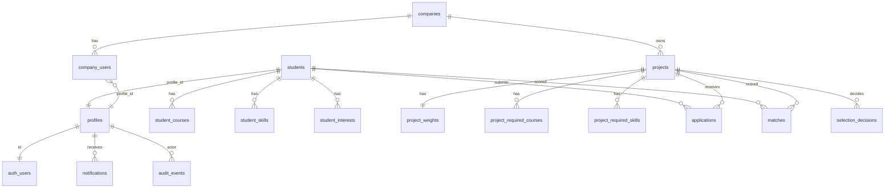

# OAMK Matching Tool — Backend-raportti

**Tekijä:** Tommi  
**Päivitetty:** 9.8.2026  
**Haara / main:** live `projects`-malli (`types/domain.ts`)

Tämä dokumentti on projektiraportin **backend- ja matching-osuus**. Frontendin käyttöliittymäosuus on Venlan vastuulla (#150).

---

## 1. Tavoite

Backendin tavoite MVP:ssä on tarjota turvallinen ja dokumentoitu rajapinta, jolla:

1. opiskelijat voivat luoda ja päivittää profiiliaan
2. yritykset voivat hallita projekteja ja harjoittelupaikkoja (`projects`, `projectType`)
3. opiskelijat voivat hakea projektiin
4. järjestelmä laskee **deterministisen** sopivuuspisteytyksen (0–100) selityksineen
5. yritys tekee lopullisen valinnan (matching ei koskaan valitse automaattisesti)
6. ilmoitukset tallentuvat sovelluksen sisällä (SMTP ei kuulu MVP:hen)

Frontend ja backend jakavat saman sopimuksen: `docs/API.md`, `types/domain.ts`, `types/api.ts`.

---

## 2. Arkkitehtuuri

Alkuperäisessä suunnitelmassa mainittiin erillinen Express-palvelin. Toteutus tehtiin **Next.js App Routerin Route Handlereihin** (`app/api/**`), koska frontend oli jo Next.js-projektissa. Deploy on yksi sovellus + Supabase.

```text
Selain / Postman / smoke-skriptit
    │  evästeet TAI Authorization: Bearer <access_token>
    ▼
Next.js middleware
    │  session refresh, roolipohjainen sivusuojaus
    ▼
app/api/*  (Route Handlers)
    │  requireAuth() → profiles.role
    ▼
Service-kerros
    students | projects | applications | matching | selections | notifications
    ▼
Supabase Postgres + Auth
    │  käyttäjäasiakas (RLS) tai service role (vain palvelin)
```

### Keskeiset kansiot

| Polku | Tehtävä |
|-------|---------|
| `app/api/**` | HTTP-reitit |
| `lib/students`, `lib/projects`, `lib/applications`, … | Liiketoimintalogiikka |
| `lib/matching/calculate-match.ts` | Pisteytysalgoritmi |
| `lib/api/auth.ts` | Autentikointi ja roolit |
| `lib/supabase/*` | Selain-, server- ja admin-clientit |
| `supabase/migrations/` | Skeema, indeksit, RLS, audit |
| `types/domain.ts` | Kanoniset TypeScript-mallit |
| `docs/API.md` | REST-sopimus |
| `scripts/flow-*.mjs` | Live API -smoket |

Legacy `/api/opportunities` palauttaa **410 Gone** — kanoninen polku on `/api/projects`.

---

## 3. Tietokanta

Yksityiskohtainen skeema: `docs/SCHEMA.md`. Migraatiot: `supabase/migrations/`.

### 3.1 ER-kaavio (yksinkertaistettu)



### 3.2 Päätaulut

| Taulu | Sisältö |
|-------|---------|
| `profiles` | Rooli (`student` / `company` / `teacher` / `admin`) |
| `companies` / `company_users` | Yritysomistus |
| `students` | Opiskelijaprofiili (opinnot, saatavuus, preferenssit) |
| `projects` | Projekti tai harjoittelu (`projectType`) |
| `project_weights` | 8 kriteerin painot, summa = 100 |
| `applications` | Hakemus; UNIQUE `(student_id, project_id)` |
| `matches` | Score 0–100 + breakdown + explanation + `weights_snapshot` |
| `selection_decisions` | Yrityksen lopullinen valinta + snapshotit |
| `notifications` | In-app -ilmoitukset |
| `audit_events` | Trigger-pohjainen audit-loki |

Sprintti 1:n `opportunities`-malli poistettiin migraatiolla; live-skeema on `projects`.

---

## 4. API-dokumentaatio

Kaikki reitit ovat muotoa `/api/...`. Auth: session-eväste **tai** Bearer-token.

### 4.1 Keskeiset reitit

| Metodi | Polku | Kuvaus |
|--------|-------|--------|
| GET | `/api/health` | Terveys + DB-ping |
| GET | `/api/me` | Käyttäjä + rooli + `studentId` / `companyId` |
| GET/POST | `/api/students` | Listaa (staff) / luo profiili |
| GET/PUT | `/api/students/:id` | Hae / päivitä |
| GET/POST | `/api/projects` | Listaa / luo (company) |
| GET/PUT/DELETE | `/api/projects/:id` | Hae / päivitä / arkistoi |
| GET | `/api/projects/:id/applicants` | Hakijat score-järjestyksessä |
| GET | `/api/projects/:id/top-candidates` | Top N (ei opiskelijalle) |
| POST | `/api/applications` | Lähetä hakemus |
| GET | `/api/applications/me` | Omat hakemukset |
| POST | `/api/applications/:id/shortlist` | Shortlist |
| POST | `/api/projects/:id/selections` | Lopullinen valinta |
| POST | `/api/matches/run` | Aja matching (oma / staff) |
| GET | `/api/matches/me` | Opiskelijan omat tulokset (ei rankia) |
| GET | `/api/notifications` | Inbox |
| GET | `/api/audit` | Audit (teacher/admin) |

Täydet esimerkit: `docs/API.md`.  
Postman: `docs/postman_collection.json` (ohje: `docs/API_TESTING.md`).  
Smoket: `npm run smoke:flows` / `smoke:security`.

### 4.2 Esimerkkivastaus — opiskelijan match

```json
{
  "data": [
    {
      "studentId": "…",
      "projectId": "…",
      "totalScore": 88,
      "scoreBreakdown": { "skills": 25, "requiredCourses": 20 },
      "matchedRequirements": { "skills": ["React", "TypeScript"] },
      "missingRequirements": { "skills": [] },
      "explanation": "Vahva sopivuus…",
      "weightsSnapshot": { "skills": 25, "requiredCourses": 20 }
    }
  ],
  "meta": { "count": 1, "studentId": "…" }
}
```

Opiskelijalle ei palauteta vertailurankia (`rank` / `peerRank`).

### 4.3 Virhekoodit

Yhtenäinen envelope `{ "error": { "code", "message", "details?" } }`.

| HTTP | `code` | Merkitys |
|------|--------|----------|
| 400 | `VALIDATION_ERROR` | Virheellinen body/parametri |
| 401 | `UNAUTHORIZED` | Ei sessiota / tokenia |
| 403 | `FORBIDDEN` | Rooli ei riitä |
| 404 | `NOT_FOUND` | Resurssia ei ole |
| 409 | `CONFLICT` | Esim. kaksoishakemus |
| 410 | `GONE` | Legacy opportunities |
| 500 | `INTERNAL_ERROR` | Odottamaton virhe |

---

## 5. Autentikointi ja roolit

- **Supabase Auth** hallitsee käyttäjätunnukset.
- `profiles.role` on sovelluksen roolin lähde (DB-trigger estää privilege escalationin).
- Middleware päivittää sessionin ja suojaa sivut roolin mukaan.
- `/api/*` palauttaa JSON 401/403 — ei HTML-redirectiä.
- Postman/skriptit: `Authorization: Bearer <access_token>`.

| Toiminto | student | company | teacher | admin |
|----------|---------|---------|---------|-------|
| Oma opiskelijaprofiili | kyllä | — | — | kyllä |
| Luo/muokkaa omia projekteja | ei | kyllä | ei* | kyllä |
| Hae projektiin | kyllä | ei | ei | — |
| Näe Top 3 / hakijat | ei | omat | kyllä | kyllä |
| Lopullinen valinta | ei | omat | ei | kyllä |
| Aja matching itselleen | kyllä | projekti | kyllä | kyllä |
| Audit | ei | ei | kyllä | kyllä |

\* Teacher = oversight only; `projects.company_id` kuuluu yritykselle.

---

## 6. Row Level Security (RLS)

Kaikilla sovellustauluilla RLS on päällä. Apufunktiot: `current_user_role()`, `is_admin()`, omistus- ja company-membership -tarkistukset.

Periaate:

- opiskelija muokkaa vain omia rivejään ja näkee vain oman matchinsa
- yritys hallitsee omia projektejaan ja näkee niihin liittyvät hakijat
- opettaja lukee oversight-tarkoituksessa, ei omista projekteja
- service role ohittaa RLS:n vain palvelimen privileged-toiminnoissa (match-upsert, ilmoitus toiselle käyttäjälle)

Katso myös `docs/SECURITY.md`.

---

## 7. Matching-algoritmi

Toteutus: `lib/matching/calculate-match.ts` (+ explain / normalize / constants).  
Algoritmi on **deterministinen**: samat syötteet → sama score, breakdown ja selitys.

### 7.1 Pisteytyskaava

Kahdeksan kriteeriä, kokonaislukupainot (summa 100). Kullekin suhde \(r_c \in [0,1]\):

\[
\text{contribution}_c = \mathrm{round}(w_c \cdot r_c),\quad
\text{totalScore} = \mathrm{clamp}(0, 100, \sum_c \text{contribution}_c)
\]

### 7.2 Oletuspainotukset

| Kriteeri | Paino |
|----------|-------|
| studyCredits | 10 |
| requiredCourses | 20 |
| recommendedCourses | 10 |
| skills | 25 |
| language | 10 |
| availability | 10 |
| interests | 10 |
| degreeProgramme | 5 |
| **Yhteensä** | **100** |

Painot asetetaan projektikohtaisesti (`project_weights`). Virheellinen summa → `400 VALIDATION_ERROR`.

### 7.3 Selitys, snapshot ja yksityisyys

- `explanation` FI/EN (`locale`)
- Jokainen `matches`-rivi tallentaa `weights_snapshot`
- Valinta tallentaa lisäksi `match_snapshot` + `algorithm_rank` auditia varten
- Opiskelija: `GET /api/matches/me` — ei vertailulistaa
- Yritys/opettaja/admin: Top 3 + hakijalista

Yksityiskohdat: `docs/MATCHING_ALGORITHM.md`.

---

## 8. Ilmoitukset

MVP tallentaa ilmoitukset `notifications`-tauluun (ei SMTP:tä). Esimerkkejä:

| Tapahtuma | Vastaanottaja | `type` |
|-----------|---------------|--------|
| Uusi hakemus | Yritys | `new_application_for_company` |
| Shortlist | Opiskelija | `application_shortlisted` |
| Valittu / ei valittu | Opiskelija | `student_selected` / `student_not_selected` |
| Valinta valmis | Opettaja | `selection_completed_for_teacher` |

Ilmoituksen epäonnistuminen ei kaada päätoimintoa. Emit on idempotentti.

---

## 9. Testaus

| Tyyppi | Miten |
|--------|--------|
| Unit | `npm test` (matching, privacy, e2e-rules, API-client, …) |
| Typecheck | `npm run typecheck` / `npm run verify` |
| Live API -smoket | `npm run smoke:student` / `smoke:company` / `smoke:teacher` / `smoke:flows` / `smoke:security` |
| Manuaalinen API | Postman + Bearer (`docs/API_TESTING.md`) |
| Skeema / RLS | `supabase/tests/*.sql` |

Selain-E2E (#120 / #121) on vielä manuaalinen; backend-polut on peitetty smokeilla.

---

## 10. Käyttöönotto (deploy)

Suositus: **Vercel** (Next.js) + **Supabase** (DB/Auth).

1. Luo tuotanto-Supabase-projekti  
2. Aja `supabase/migrations/*` järjestyksessä  
3. Aseta ympäristömuuttujat (`.env.example`):

   - `NEXT_PUBLIC_SUPABASE_URL`  
   - `NEXT_PUBLIC_SUPABASE_ANON_KEY`  
   - `SUPABASE_SERVICE_ROLE_KEY` (vain palvelin)  
   - `NEXT_PUBLIC_APP_URL`  

4. Deployaa Next.js-sovellus  
5. Konfiguroi Auth redirect URL:t  
6. **Älä** aja `supabase/seed.sql` tuotantoon  

Paikallinen seed-salasana `LocalDemoOnly!1` on vain demoa ja smoke-testausta varten.

---

## 11. Tekniset rajoitukset

- Matching on sääntöpohjainen, ei ML/AI.
- Ilmoitukset eivät lähde sähköpostina.
- E2E-CI live-Supabasea vasten ei ole vielä putkessa.
- Thesis-aiheet jäävät MVP:n ulkopuolelle.
- Saatavuusvertailu perustuu päivämääräikkunoihin (puuttuva data → neutraali 0.5).

---

## 12. Jatkokehitys

1. Oikea sähköposti (esim. Resend/SendGrid) `notifications`-jonosta  
2. Hienojakoisempi matching (arvosanat, soft-skills, sijainti, CEFR-tasot)  
3. Admin-analytiikka (hakemusmäärät, score-jakaumat)  
4. Automaattiset selain-E2E-testit CI:ssä  
5. OpenAPI-generointi tyypeistä

---

## 13. Yhteenveto

Backend-MVP sisältää versionoidun `projects`-skeeman (migraatiot + RLS + audit), jaetun API-sopimuksen, REST-reitit kaikille rooleille, selitettävän deterministisen matching-moottorin sekä smoke-skriptit demopolulle. Toteutus on yhdistetty Venlan frontendiin yhteisten tyyppien ja `lib/api/client.ts` -kerroksen kautta.
