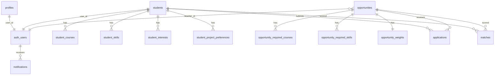

# OAMK Matching Tool — Backend-raportti

**Tekijä:** Tommi  
**Haara:** `tommi/backend-mvp`  
**PR:** https://github.com/Oamk-projektit/oamk-matching-tool/pull/130  
**Päivitetty:** 3.8.2026

Tämä dokumentti on projektiraportin **backend- ja matching-osuus**. Frontendin käyttöliittymäosuus on Venlan vastuulla.

---

## 1. Tavoite

Backendin tavoite MVP:ssä on tarjota turvallinen ja dokumentoitu rajapinta, jolla:

1. opiskelijat voivat luoda ja päivittää profiiliaan
2. opettajat voivat hallita projekteja ja harjoittelupaikkoja (`opportunity`)
3. opiskelijat voivat hakea opportunityyn
4. järjestelmä laskee **deterministisen** sopivuuspisteytyksen (0–100) selityksineen
5. ilmoitukset tallentuvat sovelluksen sisällä (sähköpostilähetys ei kuulu MVP:hen)

Frontend ja backend jakavat saman sopimuksen: `docs/API.md`, `types/domain.ts`, `types/api.ts`.

---

## 2. Arkkitehtuuri

Alkuperäisessä suunnitelmassa mainittiin erillinen Express-palvelin. Toteutus tehtiin **Next.js App Routerin Route Handlereihin** (`app/api/**`), koska frontend oli jo Next.js-projektissa. Näin deploy on yksi sovellus (esim. Vercel) + Supabase.

```text
Selain / Postman
    │  evästeet TAI Authorization: Bearer <access_token>
    ▼
Next.js middleware
    │  Supabase-session refresh, sivusuojaus
    ▼
app/api/*  (Route Handlers)
    │  requireAuth() → profiles.role
    ▼
Service-kerros
    students | opportunities | applications | matching | notifications
    ▼
Supabase Postgres + Auth
    │  käyttäjäasiakas (RLS) tai service role (vain palvelin)
```

### Keskeiset kansiot

| Polku | Tehtävä |
|-------|---------|
| `app/api/**` | HTTP-reitit |
| `lib/students`, `lib/opportunities`, … | Liiketoimintalogiikka |
| `lib/matching/engine.ts` | Pisteytysalgoritmi |
| `lib/api/auth.ts` | Autentikointi ja roolit |
| `lib/supabase/*` | Selain-, server- ja admin-clientit |
| `supabase/migrations/` | Skeema, indeksit, RLS |
| `types/` | Jaetut TypeScript-tyypit |
| `docs/API.md` | REST-sopimus |

---

## 3. Tietokanta

Yksityiskohtainen skeema: `docs/SCHEMA.md`. Migraatiot: `supabase/migrations/`.

### 3.1 ER-kaavio (yksinkertaistettu)



### 3.2 Päätaulut

| Taulu | Sisältö |
|-------|---------|
| `profiles` | Käyttäjän rooli (`student` / `teacher` / `admin`) |
| `students` | Opiskelijaprofiili (nimi, email, opinnot, kieli, saatavuus) |
| `opportunities` | Projekti tai harjoittelu (`type`) |
| `applications` | Hakemus; UNIQUE `(student_id, opportunity_id)` |
| `matches` | Pisteet 0–100 + matched/missing + explanation |
| `notifications` | Sovelluksen sisäiset ilmoitukset |
| `opportunity_weights` | Projektikohtaiset matching-painotukset |

Sprintti 1:n vanha `projects`-malli korvattiin yhtenäisellä `opportunities`-mallilla.

---

## 4. API-dokumentaatio

Kaikki reitit ovat muotoa `/api/...`. Auth: session-eväste **tai** Bearer-token.

### 4.1 Reitit

| Metodi | Polku | Kuvaus |
|--------|-------|--------|
| GET | `/api/health` | Terveystarkistus (ei auth) |
| GET | `/api/me` | Nykyinen käyttäjä + rooli + `student_id` |
| GET/POST | `/api/students` | Listaa (opettaja/admin) / luo profiili |
| GET/PUT | `/api/students/:id` | Hae / päivitä |
| GET/POST | `/api/opportunities` | Listaa / luo |
| GET/PUT/DELETE | `/api/opportunities/:id` | Hae / päivitä / poista |
| GET | `/api/opportunities/:id/applicants` | Hakijat score-järjestyksessä |
| GET | `/api/opportunities/:id/matches` | Projektin matchit |
| POST | `/api/applications` | Lähetä hakemus |
| GET | `/api/applications/me` | Omat hakemukset |
| PATCH | `/api/applications/:id` | Päivitä status |
| POST | `/api/matches/run/:studentId` | Aja matching |
| GET | `/api/matches/:studentId` | Hae tulokset |
| GET | `/api/notifications` | Inbox |
| PATCH | `/api/notifications/:id` | Merkitse luetuksi |
| POST | `/api/notifications/read-all` | Merkitse kaikki |

Täydet request/response-esimerkit: `docs/API.md`.  
Postman-kokoelma: `docs/postman_collection.json` (ohje: `docs/API_TESTING.md`).

### 4.2 Esimerkkivastaus — matching

```json
{
  "data": [
    {
      "student_id": "…",
      "opportunity_id": "…",
      "score": 88,
      "matched_courses": ["Web-ohjelmointi"],
      "missing_courses": [],
      "matched_skills": ["React", "TypeScript"],
      "missing_skills": [],
      "explanation": "Strong overall fit for this opportunity. Matched skills: React, TypeScript. …",
      "recommendation": "Ready to apply; review the opportunity description and schedule."
    }
  ],
  "meta": { "count": 1, "student_id": "…" }
}
```

### 4.3 Virhekoodit

Yhtenäinen envelope:

```json
{
  "error": {
    "code": "VALIDATION_ERROR",
    "message": "name is required",
    "details": [{ "field": "name", "message": "Required" }]
  }
}
```

| HTTP | `code` | Merkitys |
|------|--------|----------|
| 400 | `VALIDATION_ERROR` | Virheellinen body/parametri |
| 401 | `UNAUTHORIZED` | Ei sessioa / tokenia |
| 403 | `FORBIDDEN` | Rooli ei riitä |
| 404 | `NOT_FOUND` | Resurssia ei ole |
| 409 | `CONFLICT` | Esim. kaksoishakemus |
| 500 | `INTERNAL_ERROR` | Odottamaton virhe |

---

## 5. Autentikointi ja roolit

- **Supabase Auth** hallitsee käyttäjätunnukset.
- `profiles.role` on sovelluksen roolin lähde.
- Ensimmäisellä API-kutsulla `ensureProfile()` luo profiilin tarvittaessa (oletus `student`, tai metadata `role`).
- Middleware päivittää sessionin (`lib/supabase/middleware.ts`) ja suojaa sivut `getUser()`-kutsulla.
- `/api/*` ei tee HTML-redirectiä: palauttaa JSON 401.
- Postman/skriptit: `Authorization: Bearer <access_token>`.

| Toiminto | student | teacher | admin |
|----------|---------|---------|-------|
| Oma opiskelijaprofiili | kyllä | — | kyllä |
| Listaa opiskelijat | ei | kyllä | kyllä |
| Luo/muokkaa omia opportunities | ei | kyllä | kyllä |
| Hae projektiin | kyllä | ei | — |
| Näe hakijat | ei | omat | kyllä |
| Aja matching itselleen | kyllä | kyllä* | kyllä |

\* Opettaja voi ajaa/lukea matcheja opiskelijakontekstissa omien opportunityjensa yhteydessä.

---

## 6. Row Level Security (RLS)

Kaikilla sovellustauluilla RLS on päällä. Apufunktiot:

- `current_user_role()`, `is_admin()`, `is_teacher()`, `is_student()`
- `owns_student_row()`, `owns_opportunity()`

Periaate:

- opiskelija muokkaa vain omia rivejään
- opettaja lukee opiskelijatietoja, hallitsee omia projektejaan
- adminilla laajemmat oikeudet
- service role ohittaa RLS:n vain palvelimen privileged-toiminnoissa (match-upsert, ilmoitus toiselle käyttäjälle)

---

## 7. Matching-algoritmi

Toteutus: `lib/matching/engine.ts`.  
Algoritmi on **deterministinen**: samat syötteet → sama score ja selitysteksti.

### 7.1 Pisteytyskaava

Kullekin tekijälle lasketaan suhde \([0, 1]\), kerrotaan painolla ja summataan:

\[
\text{raw} =
w_c \cdot r_{\text{courses}} +
w_s \cdot r_{\text{skills}} +
w_l \cdot r_{\text{language}} +
w_h \cdot r_{\text{schedule}} +
w_p \cdot r_{\text{credits}}
\]

\[
\text{score} = \mathrm{round}(100 \cdot \text{raw}) \in [0, 100]
\]

### 7.2 Oletuspainotukset

| Tekijä | Paino | Laskenta |
|--------|-------|----------|
| Kurssit | 0.30 | matched / required (jos required=0 → 1) |
| Taidot | 0.40 | matched / required |
| Kieli | 0.10 | 1 jos sama, muuten 0 |
| Aikataulu | 0.10 | täsmäys / flexible-heuristiikka / 0.5 jos puuttuu |
| Opintopisteet | 0.10 | \(\min(1, credits / minimum)\) |

Painot voidaan asettaa opportunitykohtaisesti (`opportunity_weights`). Summan tulee olla 1.0.

### 7.3 Selitys ja suositus

- `explanation`: tiivistää sopivuuden (vahva / osittainen / heikko) + matched/missing-listat
- `recommendation`: ehdottaa puuttuvien kurssien/taitojen täydentämistä

UI voi näyttää top 3 tulosta (`GET ...?limit=3`).

### 7.4 Esimerkkilaskelma

**Opiskelija A**

- kurssit: Web-ohjelmointi, Tietokannat  
- taidot: React, TypeScript, SQL  
- kieli: FI  
- saatavuus: Full-time  
- opintopisteet: 160  

**Projekti X** (oletuspainot)

- vaaditut kurssit: Web-ohjelmointi  
- vaaditut taidot: React, TypeScript  
- kieli: FI  
- aikataulu: Flexible  
- minimum_credits: 60  

Vaiheet:

1. Kurssit: 1/1 → \(r_c = 1\)  
2. Taidot: 2/2 → \(r_s = 1\)  
3. Kieli: FI=FI → \(r_l = 1\)  
4. Aikataulu: Full-time vs Flexible → flexible-heuristiikka → \(r_h = 0.7\)  
5. Pisteet: \(\min(1, 160/60) = 1\) → \(r_p = 1\)  

\[
\begin{align*}
\text{raw} &= 0.3\cdot1 + 0.4\cdot1 + 0.1\cdot1 + 0.1\cdot0.7 + 0.1\cdot1 \\
&= 0.3 + 0.4 + 0.1 + 0.07 + 0.1 = 0.97 \\
\text{score} &= \mathrm{round}(97) = 97
\end{align*}
\]

(Todellisessa ajossa pienet erot voivat tulla aikatauluheuristiikasta; idea on sama: vahva overlap → korkea score.)

Heikko esimerkki (ei kursseja/taitoja, EN vs FI, 20 op / 100 min) tuottaa matalan scoren (&lt; 40), kuten unit-testeissä.

---

## 8. Ilmoitukset

MVP tallentaa ilmoitukset `notifications`-tauluun (ei SMTP:tä).

| Tapahtuma | Vastaanottaja | `type` |
|-----------|---------------|--------|
| Uusi hakemus | Opettaja | `application_received` |
| Hakemus hyväksytty/hylätty | Opiskelija | `application_status_changed` |
| Matching ajettu | Opiskelija | `match_ready` |

Ilmoituksen epäonnistuminen ei kaada päätoimintoa.

---

## 9. Testaus

| Tyyppi | Miten |
|--------|--------|
| Unit | `npm test` (matching, validointi, Bearer-parseri, ilmoitustekstit) — 18 testiä |
| Manuaalinen API | Postman + Bearer-token (`docs/API_TESTING.md`) |
| Health | `GET /api/health` |
| Skeema | `supabase/tests/schema_check.sql` migraatioiden jälkeen |

---

## 10. Käyttöönotto (deploy)

Suositus: **Vercel** (Next.js) + **Supabase** (DB/Auth).

1. Luo tuotanto-Supabase-projekti  
2. Aja `supabase/migrations/*` järjestyksessä  
3. Aseta ympäristömuuttujat (`.env.example`):

   - `NEXT_PUBLIC_SUPABASE_URL`  
   - `NEXT_PUBLIC_SUPABASE_ANON_KEY`  
   - `SUPABASE_SERVICE_ROLE_KEY` (vain palvelin)  
   - `NEXT_PUBLIC_APP_URL`  

4. Deployaa Next.js-sovellus  
5. Konfiguroi Auth redirect URL:t  
6. **Älä** aja `seed.sql` tuotantoon  

Paikallinen seed (`Passw0rd!`) on vain demoa ja Postman-testausta varten.

---

## 11. Tekniset rajoitukset

- Matching on sääntöpohjainen, ei ML/AI.
- Ilmoitukset eivät lähde sähköpostina.
- E2E-CI live-Supabasea vasten ei ole vielä putkessa.
- Frontend-integraatio (mock → API) on erillinen vaihe (`docs/VENLA_TASKS.md`).
- Aikatauluvertailu on yksinkertainen merkkijonheuristiikka.

---

## 12. Jatkokehitys

1. Oikea sähköposti (esim. Resend/SendGrid) `notifications`-jonosta  
2. Hienojakoisempi matching (kurssiarvosanat, soft-skills, sijainti)  
3. Admin-analytiikka (hakemusmäärät, score-jakaumat)  
4. Automaattiset integraatiotestit Supabase local stackia vasten  
5. OpenAPI-generointi tyypeistä

---

## 13. Yhteenveto

Backend-MVP sisältää versionoidun tietokannan (migraatiot + RLS), jaetun API-sopimuksen, REST-reitit opiskelijoille/projekteille/hakemuksille/matcheille/ilmoituksille sekä selitettävän deterministisen matching-moottorin. Toteutus on testattavissa unit-testeillä ja Postmanilla, ja se on valmis yhdistettäväksi Venlan frontendiin yhteisten tyyppien kautta.
